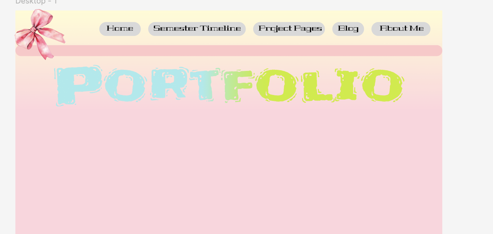

# Activity in class

In class, I learned about the grid system — a fundamental structure that helps organize layout in a clear and balanced way. This system allowed me to structure the composition of my webpage more effectively, helping me align images and text in a logical and aesthetically pleasing manner.

The image above shows a layout experiment I created during class, where I practiced arranging elements on both desktop and mobile screen formats using a responsive grid. This exercise helped me better understand how to adapt design across different devices and improve the overall user experience.

# Web Acessibility

**Accessibility Adjustments**

After our class session, I went back and tested my design to check its color contrast. I realized that the contrast wasn't strong enough, which could affect readability and accessibility. To improve this, I adjusted the text color to a slightly darker tone and softened the background color, helping the key elements stand out more clearly. The images above show my testing process and the adjustments I made to improve the overall clarity of the design.

# Column Girds

Based on what I learned in class, I applied the 12-column grid system to both the desktop and mobile versions of my webpage. This grid helped me evaluate whether my layout decisions were logical and balanced.

After applying the grid, I realized that some of my content was leaning too far to the left. Additionally, a few of the shapes I had created were uneven in width, and the spacing between sections was inconsistent. Identifying these issues early allowed me to make timely corrections, which significantly improved the structure and visual balance of my webpage.

# Change in Figma

**Design Revision Based on Feedback**

After finishing the background design for my Figma layout, I received a lot of feedback from friends and family. Many of them felt that my original background was too colorful and visually overwhelming. Their first impression was that it looked messy and didn’t feel like a professional portfolio.

Based on their comments, I decided to completely change both the background and overall direction. In the updated version (shown in the second image), I kept the “sweety” theme but refined it with a softer pink and cream color palette. I also chose darker, more muted text colors to avoid harsh contrast and to keep everything more readable and balanced.

**Final Decision**

My original wreframe included more decorative and non-standard placements: curved sections, misaligned elements and irregular spacing.while they looked interesting, i found that they made the actual content harder to follow and reducede clarity.

in the updated version, i adopted a more minimalistic approach. This not only helps present information in logical flow but also provides visual balance.Blog entries, imaged and project descriptions are now aligned consistently.its easier for users to read and focus on specific areas of the site without being overwhelmed.

**Improving Contrast in My Minimalist Web Design**

After switching my design concept to a minimalist style, I decided to re-check everything using an AI contrast checker. To my surprise, everything performed much better than before. The colors I selected passed the accessibility checks perfectly, and I didn’t face the same issues I had with my previous ideas.

Earlier designs had problems with background colors and font choices, which made it really difficult to adjust and maintain consistency. However, with the minimalist approach, the simpler color palette made it easier to manage contrast and ensure readability across the site.

**Reflection on the design process**

Looking back, I see this change as a natural part of design process. I started with an idea that felt right at the time, but as I developed the website and got closer to the core of what I want to express, I was able to see more clearly what worked, and what didn’t. 
# Progress in Figma

After applying the initial wireframe I had designed to my blog layout, I realized that I had included too many images and not enough supporting documents that are essential for a portfolio. While the visuals made the page look lively, they lacked the necessary context to help viewers understand the projects in depth.

Because of this, I decided to redesign my wireframe. The new version balances both images and written documentation, making the content more informative and engaging. Now, users can not only enjoy the visual side of my work but also gain a clearer understanding of the ideas and processes behind each project — all without feeling overwhelmed or bored.

**From Wireframe to Figma**

After redesigning my wireframes, I started applying them in Figma — and the result exceeded my expectations. Every element, from images to typography, became much clearer and more cohesive. The visual structure looked more balanced, and the overall layout began to reflect the minimalist aesthetic I was aiming for.

Using the grid system made a significant difference. It helped me align elements precisely, maintain equal spacing, and ensure consistency across both the desktop and mobile versions. This not only improved the overall usability of the website but also enhanced its visual appeal. I'm especially happy with how the revised design feels more professional and easier to navigate, allowing users to focus on both the visuals and the content of my portfolio.

**Some problems**

After designing the new wireframes, I began applying them in Figma — and overall, the outcome was very satisfying. The layout felt more structured, the images and typography appeared much clearer, and the overall visual hierarchy improved significantly. Thanks to the grid system, I was able to align and position elements with greater accuracy, which helped my portfolio feel more professional and easier to navigate across both desktop and mobile.

However, not every wireframe translated perfectly into Figma. During the process, I noticed two small but important issues. In the first layout, the main image turned out too large — once imported into Figma, it overwhelmed the screen and drew attention away from the important information below. In contrast, the second layout had the opposite problem: the image was too small, and the text was too dense. This made the page look unbalanced and visually uninteresting, failing to draw users into the visual content I had carefully created.

Realizing these problems helped me make necessary adjustments. For the first issue, I resized the image to make room for supporting text content, creating a more readable layout. For the second, I enlarged the image to give it more presence, while shortening the text to maintain a better balance between words and visuals. These small refinements helped improve the overall usability and storytelling of my webpage.

**Effects in Figma**

Beyond just inserting images and arranging text, I explored a variety of interactive effects in Figma to make my webpage more dynamic and engaging. I experimented with hover effects, automatic horizontal scrolling, and transitions between pictures — each designed to guide the viewer’s attention and create a smoother, more enjoyable experience.

However, creating these effects was not easy. I faced many challenges, especially in building proper components and making sure the interactions worked as intended. I failed many times, got stuck in endless trial-and-error cycles, and often felt frustrated when things didn’t respond the way I expected. But instead of giving up, I sought out help — watching countless tutorials on YouTube and even quick tips on TikTok to better understand how these tools work.

Eventually, all the effort paid off. The interactive elements I created not only brought life to my webpage, but also gave me a much deeper understanding of how motion and interaction can elevate user experience. They helped break the monotony of static content, encouraged playful exploration, and most importantly, made my portfolio feel more personal and alive.

Through this process, I also became more confident in using Figma’s advanced features — especially prototyping and interaction design — which are valuable skills for my future goals as a UX designer.
# Comparision

**From “Sweety Candy” to Minimalist — A Turning Point in My Design Process**

As I mentioned in earlier blog posts, my initial concept for the portfolio website was a playful “sweety candy” style — filled with vibrant colors, playful elements, and a bright, cheerful tone. However, after starting to build the first few pages, I quickly realized that this concept, while visually fun, wasn’t suitable for a professional portfolio.

The excessive use of colors made it extremely difficult to choose matching typefaces and readable text colors. Instead of enhancing the experience, the colorful layout felt overwhelming and distracted from the content. More importantly, it created accessibility issues that could make it uncomfortable for users to navigate the site.

Recognizing these problems, I made a bold decision to shift completely to a minimalist design approach. When I began prototyping this new version in Figma, it became clear that I had made the right choice. The minimalist color palette brought clarity and visual harmony, making it easier for users to follow the content. The calm, clean design not only improved the overall aesthetic but also ensured a more inclusive and user-friendly experience.

Additionally, in my original concept, I misunderstood a key requirement of the assignment — instead of designing a scrolling webpage, I mistakenly created multiple separate frames. This structural error led me to revisit the brief more carefully, and in my revised design, I committed to building a single scrolling webpage, as required. The switch to a minimalist style also worked better with this format, allowing for smooth transitions and a more cohesive visual journey.

This turning point taught me an important lesson about flexibility in the creative process: sometimes we have to let go of ideas we love in order to serve the bigger picture — functionality, clarity, and user experience.

